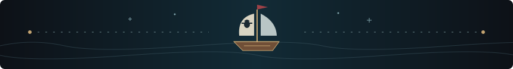
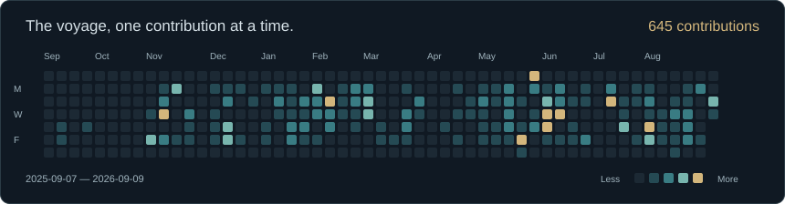

<!-- Main profile source. Edit this file directly. -->

  

<h1 align="center">Mounesh S · Full-Stack AI Engineer</h1>

Software Engineer at <b>CasaRetail AI</b> · Salem, Tamil Nadu, India

<i>A builder’s mind. A pirate’s freedom.</i>

  
  
  

<a href="#the-shipwright">About</a> · <a href="#the-thousand-sunny-dockyard">Selected work</a> · <a href="#the-four-road-poneglyphs">Stack</a> · <a href="#the-voyage-so-far">Journey</a> · <a href="#the-captains-log">Activity</a>

## The shipwright

I build **AI features, full-stack products, and the data systems that connect them**. At CasaRetail AI, that means taking a feature from its database schema and APIs through the React interface to production.

Right now, I’m working on **configuration-driven vendor routing**, **tenant onboarding**, and **DSPy-powered summaries and column mapping**. I care about clear interfaces, durable data, and systems that remain understandable when something goes wrong.

> **One Piece alter ego:** The Emperor · New World explorer · Hito Hito no Mi, Model: Nika. 
> Big ambitions. A dependable crew. One well-built ship at a time.

### Built in real waters

| Scale | What it represents |
| :--- | :--- |
| **40+ enterprise tenants** | Retail platform delivery and loyalty-data migrations at CasaRetail AI. |
| **200K+ bills · 685K+ product records** | Processed in a single ingestion run, representing **₹1.01B in invoice value**. |
| **3.62 ms → 1.85 ms p99** | Routing benchmark at 2 vs. 4 CPUs, with two stateless replicas behind Nginx. |

Ingestion figures describe one job; routing latency describes the measured deployment configuration.

## The Thousand Sunny dockyard

A selection of the products and systems I’ve worked on. Company work and private projects are labelled below.

| Vessel | What I built |
| :--- | :--- |
| **Vendor Routing Platform** CasaRetail AI · Internal | Versioned vendor configuration, a React console, and a Quarkus / Apache Camel data plane. New integrations through configuration; requests accepted after durable Kafka acknowledgement. React · Quarkus · Apache Camel · Kafka · PostgreSQL |
| **Tenant Onboarding** CasaRetail AI · Internal | Connection testing, AI-assisted source-to-target mapping, historical backfill, and scheduled sync in one workflow. React · Python · DSPy · SQL |
| **Pulse** Personal project · Private | An AI content workspace with shared client/server Zod contracts, provider failover, and publishing controls driven by platform capabilities. TypeScript · React · Fastify · Zod |
| **Retail Data Streams** CasaRetail AI · Internal | Configuration-driven ETL and Kafka-to-ClickHouse streaming, with validation, retries, offset management, and dead-letter handling. Python · Kafka · NiFi · ClickHouse |
| **Subscription Management** CasaRetail AI · Internal | Delivered the schema, APIs, and billing screens; added automated renewals and two-way customer/invoice sync with Zoho Books. React · Express · PostgreSQL · OAuth 2.0 |

<b>From the research archives · Keystroke Anomaly Detection</b>

Engineered keystroke-timing features and trained a **One-Class SVM** to flag unusual typing patterns for endpoint-security research. Presented as *Advanced Keylogging Framework* at **ICETER ’24**.

**Python · Scikit-learn · NumPy · Pandas**

[Explore the research repository](https://github.com/Mounesh-S/Advanced_Keylogger-with-ML-model)

## The four Road Poneglyphs

Four disciplines that help me take an idea all the way to a working product.

| Poneglyph | My toolkit |
| :--- | :--- |
| **Intelligence** · Make AI useful | DSPy · MCP · RAG · Model routing · Scikit-learn |
| **Experience** · Build the whole product | React · TypeScript · JavaScript · FastAPI · Node.js · Fastify |
| **Data** · Keep the current moving | Python · SQL · Kafka · NiFi · ClickHouse · PostgreSQL · Redis |
| **Reliability** · Be ready for rough seas | Docker · Linux · Nginx · GitHub Actions · Prometheus · Grafana |

## The voyage so far

**East Blue · 2022–2026** 
B.Tech in Artificial Intelligence and Data Science, Bannari Amman Institute of Technology · **8.24/10 CGPA**.

**Water 7 · July 2025–July 2026** 
Software Engineer Intern at CasaRetail AI. React interfaces, APIs, subscription billing, and enterprise retail ETL.

**The New World · July 2026–present** 
Software Engineer at CasaRetail AI. Vendor routing, onboarding automation, and AI features inside real products.

<b>World Government archives · Awards &amp; research</b>

- **Reliance Undergraduate Scholar** — ₹5,00,000 scholarship for academic excellence.
- **TCS CodeVita Season 12** — ranked 971 of 1,347 competitors globally in Round 2.
- **ICETER ’24** — *Advanced Keylogging Framework* research presentation.

## The captain’s log

<b>World Economic Journal · Recent public activity</b>

<!--START_SECTION:activity-->
- 2026-09-08 · 💬 Started a discussion “⚓ Sign the Log Pose — say hello!” in [Mounesh-S/Mounesh-S](https://github.com/Mounesh-S/Mounesh-S)
- 2026-09-08 · 👥 Added as a collaborator on [Mounesh-S/Advanced_Keylogger-with-ML-model](https://github.com/Mounesh-S/Advanced_Keylogger-with-ML-model)
- 2026-09-08 · 🍴 Forked [zetbrush/multiagents](https://github.com/zetbrush/multiagents)
- 2026-09-08 · 🍴 Forked [rohitg00/ai-engineering-from-scratch](https://github.com/rohitg00/ai-engineering-from-scratch)
- 2026-09-08 · 🍴 Forked [MadsLorentzen/ai-job-search](https://github.com/MadsLorentzen/ai-job-search)
<!--END_SECTION:activity-->

[View all public activity](https://github.com/Mounesh-S?tab=overview)

<b>Open the ship’s log · GitHub overview &amp; languages</b>

  

<i>There’s always another island. Keep building.</i>

---

<b>The Den Den Mushi is listening.</b> Have an AI product, full-stack build, or data problem in mind? <a href="mailto:mounesh0711@gmail.com">Let’s build something worth setting sail for.</a>

One Piece fan theme · Artwork created for this profile · <a href="https://github.com/Mounesh-S/Mounesh-S/discussions">Leave a message in the logbook</a>

