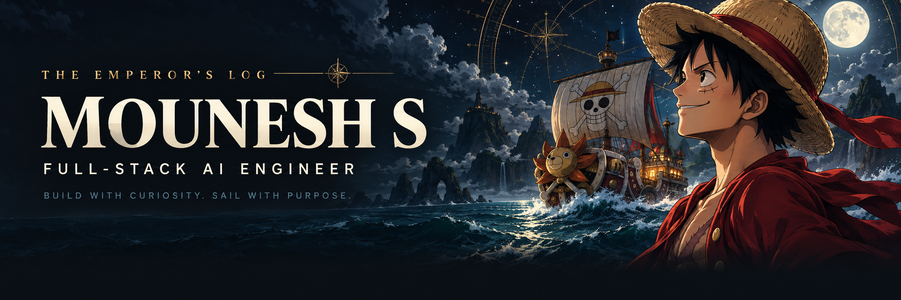
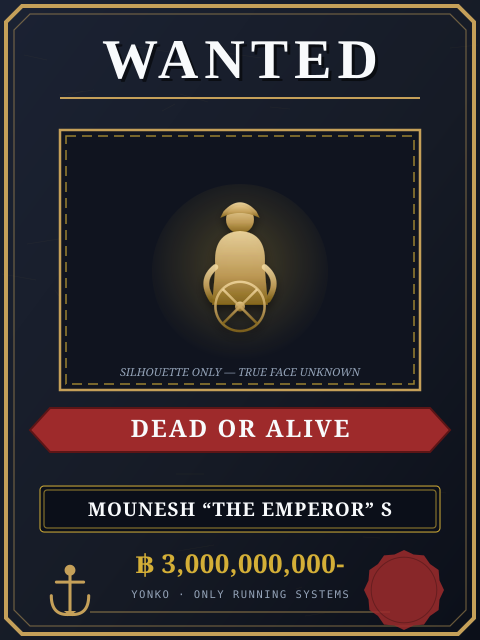
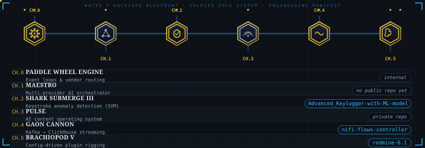
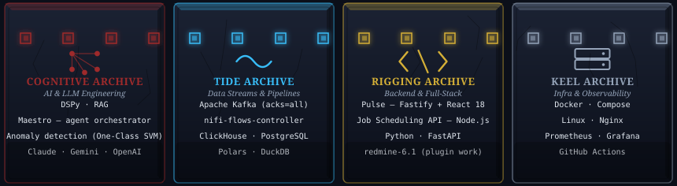
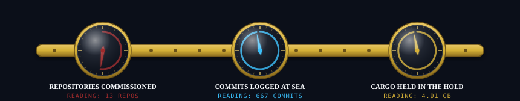
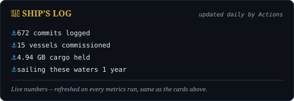
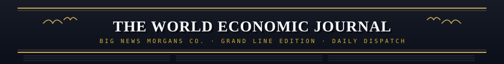
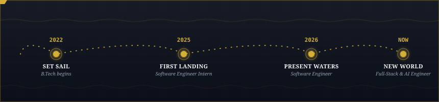
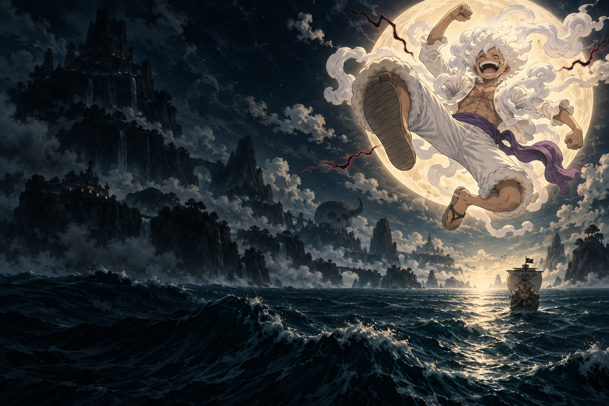
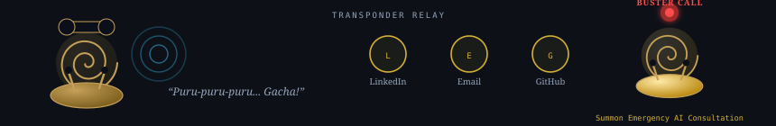

<!--
  ┌────────────────────────────────────────────────────────────────┐
  │  Mounesh-S / Mounesh-S  ·  profile README  ·  theme: ONE PIECE │
  │  palette: Midnight Grand Line / Dark Obsidian                  │
  │  LAYER 1 static markdown · LAYER 2 live CDN · LAYER 3 self-hosted (assets/, Actions) │
  │  Illustrations in assets/op_*.svg are original SVGs, generated by a script and │
  │  committed here — GitHub serves them directly, so they can't 402 or go dark.   │
  │  emperors-log.png / new-world.png are AI-generated One Piece fan art           │
  │  (see docs/ARTWORK.md) — not official artwork, included at the owner's call.   │
  │  Every claim below traces to a real source in Documents/Resume/ — no          │
  │  invented numbers, and forked repos are excluded from the fleet.              │
  └────────────────────────────────────────────────────────────────┘
-->

<div align="center">

# Mounesh S
### Full-Stack AI Engineer · CasaRetail AI

Building AI features, full-stack products, and the data systems that connect them — from database schema and APIs through the React interface to production.


<a href="https://www.linkedin.com/in/mounesh-s-131a56273"></a>
<a href="mailto:mounesh0711@gmail.com"></a>
<a href="https://github.com/Mounesh-S/Mounesh-S/discussions"></a>


</div>

<br/>

<details>
<summary align="center"><i>🏴‍☠️ There's a One Piece theme running through this profile — click to sail in</i></summary>

<div align="center">



<a href="https://github.com/Mounesh-S">
  

<br/><br/>


<br/><br/>

<a href="https://github.com/Mounesh-S"></a>
<a href="https://github.com/Mounesh-S/Advanced_Keylogger-with-ML-model"></a>

</div>

</details>

---

## `☠ DOSSIER OF THE SHIPWRIGHT`

<table>
<tr>
<td width="42%" valign="top" align="center">

<a href="https://www.linkedin.com/in/mounesh-s-131a56273" title="Open the full dossier on LinkedIn">
  
</a>

</td>
<td width="58%" valign="top">

```yaml
name:        Mounesh S
epithet:     "The Emperor"
ambition:    King of the Pirates
rank:        Yonko (Emperor)
crew:        CasaRetail AI
devil_fruit: Hito Hito no Mi, Model: Nika — Sun God (Awakened)
haki:        Python · TypeScript · SQL
sea:         Salem, Tamil Nadu · UTC+5:30
creed:       "I don't want to conquer anything. I just think the
             person with the most freedom in this whole ocean...
             is the King of the Pirates!" — Monkey D. Luffy
```

> 🏴‍☠️ **Sound the horn if you need:** full-stack builds, event-driven
> backends, Kafka/NiFi pipelines, DSPy / agent tooling — or a second
> opinion on why your p99 looks like a Sea King attack.

</td>
</tr>
</table>

---

## `⚓ CURRENT VOYAGE`

| | island | what's waiting there |
|---|---|---|
| 🧠 | **MCP servers & agent tooling** | typed access to internal systems |
| 🌊 | **Apache NiFi flow control** | steer data flows from code, not a canvas |
| 🧩 | **Redmine plugins** | an old ship refitted for a modern crew |
| 🐍 | **Full-stack apps & Python services** | frontend to backend, plus the rigging that holds it together |

---

## `🔧 THE THOUSAND SUNNY DOCKYARD`

*Water 7 shipwrighting, mapped onto the fleet I actually maintain.*

<div align="center">



</div>

<br/>

| ship | status | log entry |
|---|---|---|
| **Maestro** | captained | Multi-provider AI agent orchestrator — CLI routing chat/research/architecture/review/implement to the best-suited provider; heuristic zero-call classification cuts 20K–28K tokens per invocation. *(no public repo yet)* |
| [`Advanced_Keylogger-with-ML-model`](https://github.com/Mounesh-S/Advanced_Keylogger-with-ML-model) | captained | Keystroke-timing anomaly detection with a One-Class SVM, flagging unusual typing patterns for endpoint security — presented at ICETER '24. |
| **Pulse** | captained | AI content operating system — Fastify + React 18, shared Zod contract, automatic primary-to-fallback model routing. *(private repo)* |
| [`nifi-flows-controller`](https://github.com/Mounesh-S/nifi-flows-controller) | captained | Kafka → ClickHouse streaming, NiFi flow control for retail data pipelines. |
| [`redmine-6.1`](https://github.com/Mounesh-S/redmine-6.1) | captained | Enterprise rigging — config-driven plugin work on an existing platform. |
| **Vendor Routing Platform** | captained | Versioned vendor configuration, a React console, and a Quarkus / Apache Camel data plane — new integrations shipped through config, not code. *(CasaRetail AI · internal)* |
| **Tenant Onboarding** | captained | Connection testing, AI-assisted source-to-target mapping, historical backfill, and scheduled sync in one workflow. *(CasaRetail AI · internal)* |
| **Subscription Management** | captained | Schema, APIs, and billing screens for subscriptions, with automated renewals and two-way Zoho Books sync. *(CasaRetail AI · internal)* |

---

## `⚔ THE FOUR ROAD PONEGLYPHS`

*Four stones. Read together, they mark the way to Laugh Tale. Read separately, they're just my stack.*

<div align="center">



<br/><br/>

**cognitive archive** — AI &amp; LLM engineering &nbsp;·&nbsp; <a href="https://github.com/Mounesh-S/Advanced_Keylogger-with-ML-model">open the ledger ↗</a>


**tide archive** — data streams &amp; pipelines &nbsp;·&nbsp; <a href="https://github.com/Mounesh-S/nifi-flows-controller">open the ledger ↗</a>


**rigging archive** — backend &amp; full-stack &nbsp;·&nbsp; <a href="https://github.com/Mounesh-S/redmine-6.1">open the ledger ↗</a>


**keel archive** — infra &amp; observability &nbsp;·&nbsp; <a href="https://github.com/Mounesh-S/Mounesh-S/tree/main/.github/workflows">open the ledger ↗</a>


</div>

---

## `🧭 LOG POSE NAVIGATION`

*A real Log Pose points at something real. These three needles read live numbers — repositories, commits, storage — refreshed daily by Actions, not fixed dial positions.*

<div align="center">



<br/><br/>

<!-- LAYER 3 — rendered into this repo by .github/workflows/metrics.yml. Served by GitHub itself. -->


<br/><br/>


<br/><br/>




<br/><br/>


<br/><br/>


</div>

---

## `📰 WORLD ECONOMIC JOURNAL`

<div align="center">



</div>

<p align="center"><i>Big News Morgans dispatch — filed straight into this page as text, kept current every 30 minutes by <code>activity.yml</code>. No image, nothing to hotlink, nothing to break.</i></p>

<!--START_SECTION:activity-->
- 2026-09-08 · 💬 Started a discussion “⚓ Sign the Log Pose — say hello!” in [Mounesh-S/Mounesh-S](https://github.com/Mounesh-S/Mounesh-S)
- 2026-09-08 · 👥 Added as a collaborator on [Mounesh-S/Advanced_Keylogger-with-ML-model](https://github.com/Mounesh-S/Advanced_Keylogger-with-ML-model)
- 2026-09-08 · 🍴 Forked [zetbrush/multiagents](https://github.com/zetbrush/multiagents)
- 2026-09-08 · 🍴 Forked [rohitg00/ai-engineering-from-scratch](https://github.com/rohitg00/ai-engineering-from-scratch)
- 2026-09-08 · 🍴 Forked [MadsLorentzen/ai-job-search](https://github.com/MadsLorentzen/ai-job-search)
<!--END_SECTION:activity-->

---

## `🌊 THE VOYAGE SO FAR`

<div align="center">



</div>

<p align="center"><i>set sail 2022 · first landing 2025 · present waters 2026</i></p>

<div align="center">



</div>

<p align="center"><i>There's always another island. Keep building.</i></p>

---

## `📞 TRANSPONDER SNAIL RELAY`

<div align="center">



<br/><br/>

<a href="https://www.linkedin.com/in/mounesh-s-131a56273"></a>
<a href="mailto:mounesh0711@gmail.com"></a>
<a href="https://github.com/Mounesh-S"></a>

<br/><br/>

<a href="https://github.com/Mounesh-S/Mounesh-S/discussions"></a>

</div>

<p align="center"><i>Every ship that passes leaves a mark — <a href="https://github.com/Mounesh-S/Mounesh-S/discussions">open a Discussion</a> and say hello.</i></p>

<br/>

> ### 🐌 BUSTER CALL
> Facing critical system bottlenecks, architectural debt, or need an AI agent
> fleet built from scratch? **Sound the Golden Den Den Mushi.** Five marine
> HQ ships and a vice admiral will not arrive — but I will, with a
> full-stack rebuild plan and a Python REPL open.

---

<details>
<summary><b>📜 World Government Archives — honors &amp; academics</b></summary>
<br/>

- **Reliance Undergraduate Scholar** — ₹5,00,000 scholarship for academic excellence
- **TCS CodeVita Season 12** — ranked 971 of 1,347 competitors globally (Round 2)
- **B.Tech, Artificial Intelligence and Data Science** — Bannari Amman Institute of Technology, CGPA 8.24/10
- **Paper Presentation, ICETER '24** — *Advanced Keylogging Framework*, One-Class SVM anomaly detection for endpoint security ([`Advanced_Keylogger-with-ML-model`](https://github.com/Mounesh-S/Advanced_Keylogger-with-ML-model))

</details>
